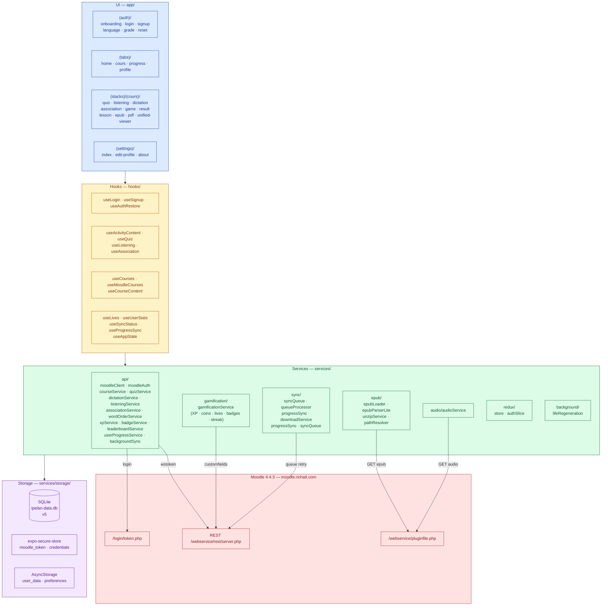
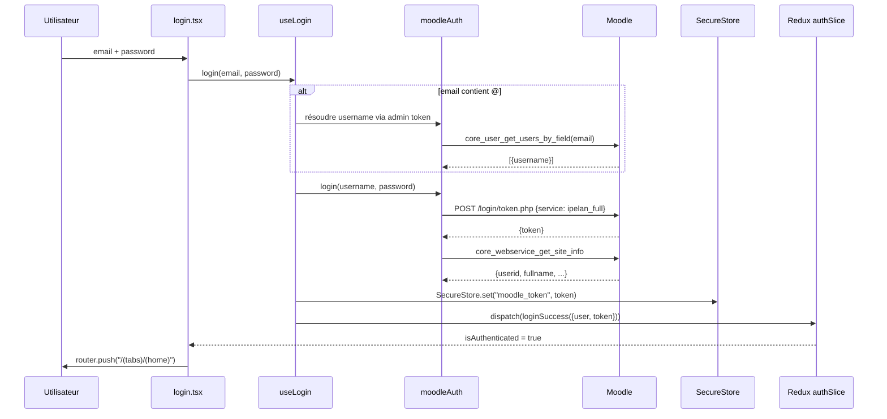
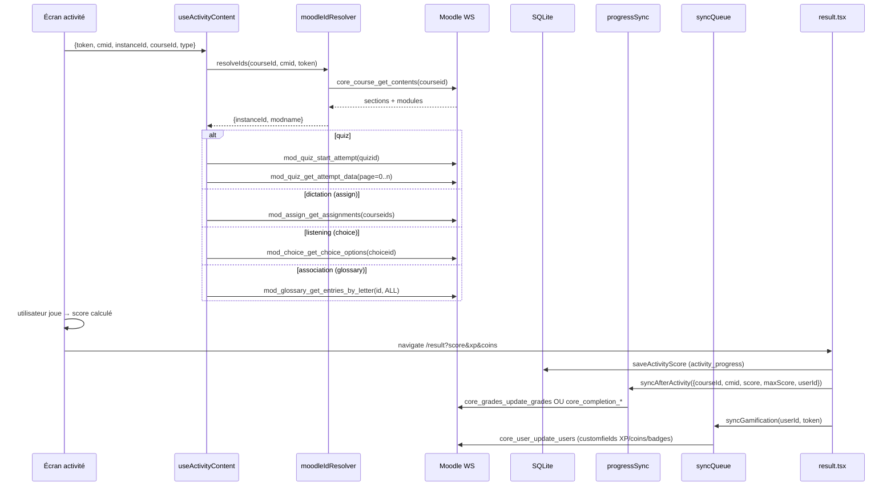
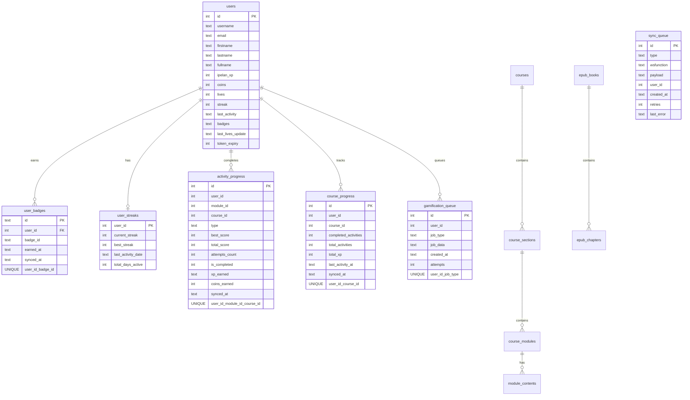

# IPELAN — Architecture Générale

> Diagrammes Mermaid. Rendu natif sur GitHub, VS Code (Markdown Preview Mermaid), Obsidian.

---

## 1. Vue d'ensemble — Couches



---

## 2. Flux d'authentification



**Restauration au démarrage** (`app/index.tsx`) :
1. Lit le token depuis `SecureStore`
2. Lit `user_data` depuis `AsyncStorage`
3. Dispatch `loginSuccess` → navigation automatique vers tabs

---

## 3. Flux d'une activité complète



---

## 4. Schéma SQLite complet (v5)



**Versionnement schema** (`PRAGMA user_version`) :

| Version | Migration |
|---------|-----------|
| v1 | `users.lives`, `last_activity`, `last_lives_update` |
| v2 | `user_badges` + index |
| v3 | `sync_queue.user_id` ; `course_progress` UNIQUE(user_id, course_id) |
| v4 | `users.token_expiry` |
| v5 | `gamification_queue` — persistance jobs in-memory entre crashes |

---

## 5. Stack technique

| Couche | Technologie | Version |
|--------|-------------|---------|
| Framework | Expo | ~54.0 |
| Runtime | React Native | 0.81.5 |
| Routing | expo-router | ~6.0.23 |
| Language | TypeScript | ~5.9.2 |
| State global | Redux Toolkit + react-redux | 2.11.2 / 9.2.0 |
| Styling | NativeWind + TailwindCSS | 2.0.11 / 3.3.2 |
| SQLite | expo-sqlite | ~16.0.10 |
| Secure Storage | expo-secure-store | ~15.0.8 |
| Key-Value | AsyncStorage | ~2.2.0 |
| Audio | expo-audio | ~1.1.1 |
| EPUB | jszip + xmldom + pako | 3.10.1 / 0.6.0 / 2.1.0 |
| PDF | react-native-pdf | ^7.0.4 |
| WebView | react-native-webview | 13.15.0 |
| Animations | reanimated + gesture-handler | ~4.1.1 / ~2.28.0 |
| Background | expo-background-fetch | ^55.0.15 |
| Connectivity | netinfo | ^12.0.1 |

---

## 6. Variables d'environnement

```env
EXPO_PUBLIC_MOODLE_API_URL=https://moodle.richatt.com
EXPO_PUBLIC_MOODLE_ADMIN_TOKEN=<token-admin-wstoken>
EXPO_PUBLIC_EPUB_BASE_URL=https://moodle.richatt.com
EXPO_PUBLIC_AUDIO_BASE_URL=https://moodle.richatt.com
```

> ⚠️ Toutes les variables React Native **doivent** commencer par `EXPO_PUBLIC_`.  
> `EXPO_PUBLIC_MOODLE_ADMIN_TOKEN` n'est utilisé que pour les opérations admin (signup, enrol, grade push, profile update).

---

## 7. Conventions de code

| Convention | Règle |
|------------|-------|
| Appels Moodle | Toujours via `moodleCall()` ou `moodleFetch()` |
| Token admin | `EXPO_PUBLIC_MOODLE_ADMIN_TOKEN` uniquement pour ops admin |
| Styling |  `StyleSheet.create` |
| Navigation | `useRouter().push(path as any)` — cast nécessaire (types stricts) |
| Logs dev | Gardés par `const IS_DEV = process.env.NODE_ENV === "development"` |
| Alias | `@/` → racine projet (tsconfig) |
