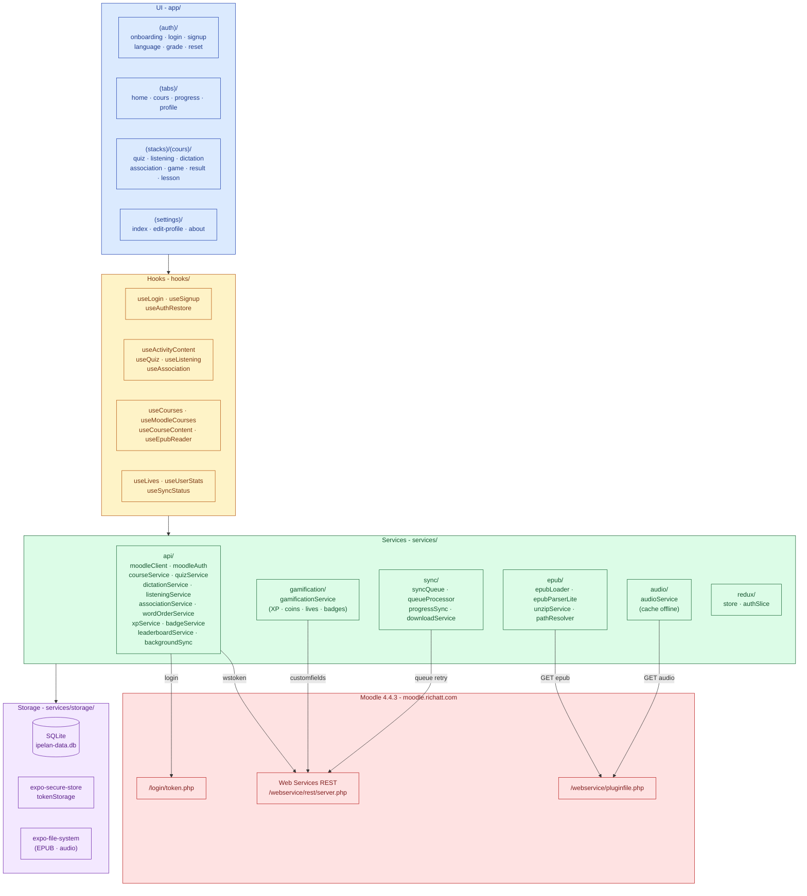
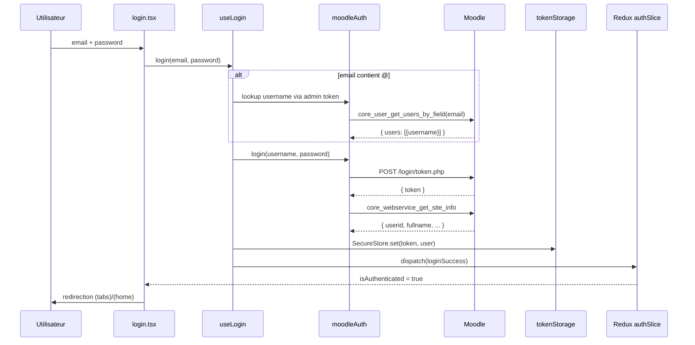
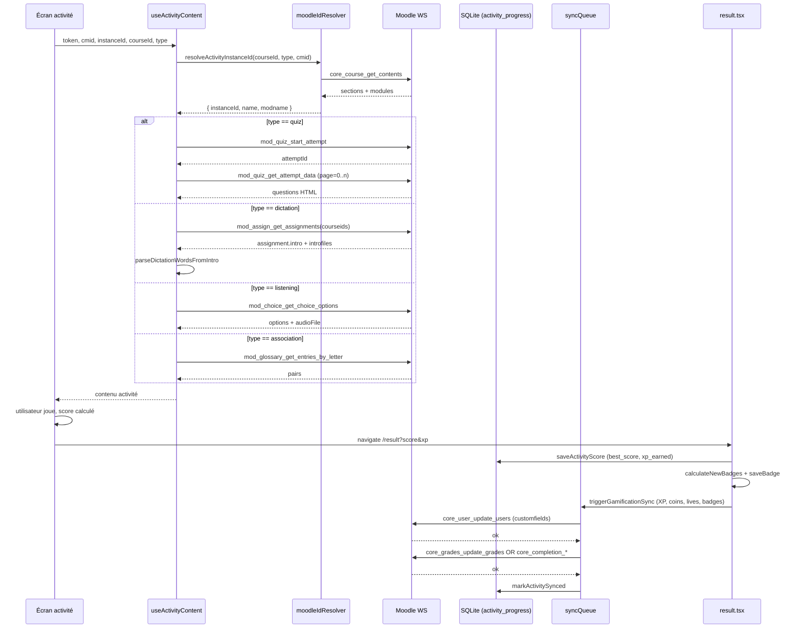
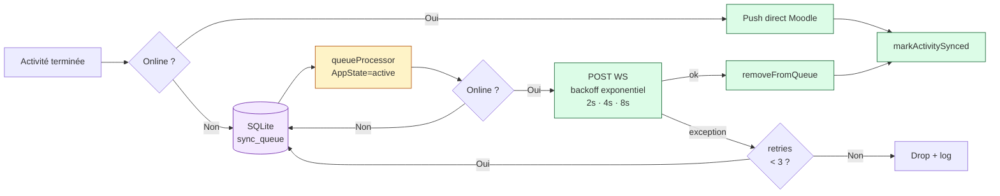
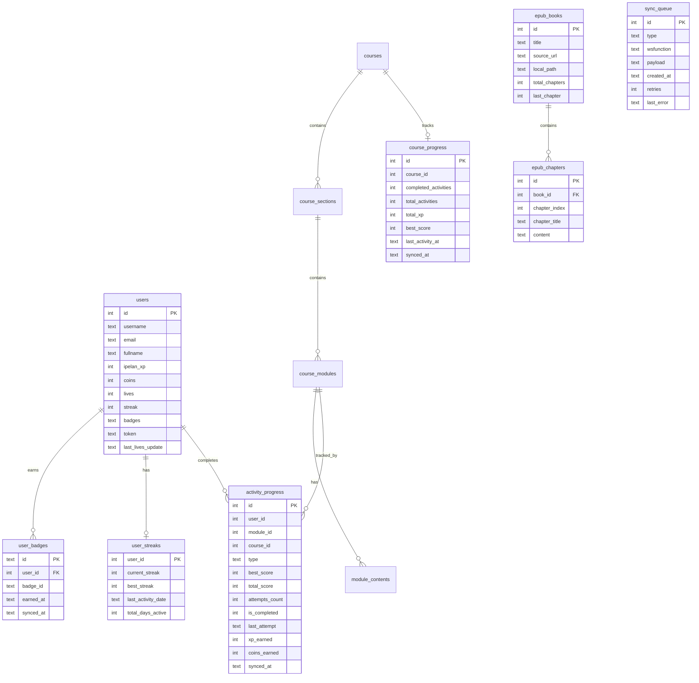

# IPELAN — Architecture

> Diagrammes générés en Mermaid. Rendu natif sur GitHub, VS Code (extension Markdown Preview Mermaid Support), Obsidian, GitLab.

Ce document décrit l'architecture en couches de l'application mobile IPELAN
(React Native + Expo SDK 54) et ses interactions avec Moodle 4.4.3.

Le projet est organisé en quatre couches (UI, Hooks, Services, Storage) plus
un backend Moodle externe.

---

## 1. Vue d'ensemble — Couches



---

## 2. Flux d'authentification



---

## 3. Flux d'une activité (Quiz / Listening / Dictation / Association)



---

## 4. Mode hors ligne — File de sync persistante



---

## 5. Pipeline EPUB (lecture hors ligne)

```mermaid
flowchart LR
    URL[URL EPUB Moodle] --> DL[downloadService<br/>downloadEPUB]
    DL --> CACHE[(Cache local<br/>expo-file-system)]
    CACHE --> UNZ[unzipService<br/>react-native-zip-archive]
    UNZ --> CONT[META-INF/container.xml]
    CONT --> OPF[epubParserLite<br/>findOPFPath + parseOPFLite]
    OPF --> SPINE[Spine + manifest items]
    SPINE --> RES[pathResolver<br/>résolution chemins relatifs]
    RES --> WV[EPUBLessonViewer<br/>WebView baseURL=file://]
    WV --> SQLDB[(SQLite<br/>epub_books<br/>epub_chapters)]

    classDef ext fill:#fee2e2,stroke:#b91c1c;
    classDef io fill:#dbeafe,stroke:#1e40af;
    classDef db fill:#f3e8ff,stroke:#6b21a8;
    class URL ext;
    class CACHE,WV io;
    class SQLDB db;
```



---

## 6. Schéma de la base SQLite



---

## 7. Synchronisation Gamification → Moodle (customfields)

| Custom field Moodle | Source locale | Type |
|---|---|---|
| `ipelan_xp` | `users.ipelan_xp` (somme `activity_progress.xp_earned`) | int |
| `ipelan_coins` | `users.coins` | int |
| `ipelan_lives` | `users.lives` (max 6, regen 1 / 12 h) | int |
| `ipelan_streak` | `user_streaks.current_streak` | int |
| `ipelan_badges` | `user_badges.badge_id` joints par `,` | text |
| `ipelan_badges_count` | `count(user_badges)` | int |
| `ipelan_last_badge` | dernier badge gagné (ordre `earned_at`) | text |

> **Préalable côté Moodle** : ces champs personnalisés doivent être créés
> (Site administration → Users → User profile fields). Sans eux, la sync
> retourne une erreur de permission qui est gérée gracieusement.

---

## 8. Stack technique

| Couche | Technologie | Version |
|---|---|---|
| Framework | Expo | ~54.0 |
| Runtime | React Native | 0.81.5 |
| Routing | expo-router | ~6.0.23 |
| State | Redux Toolkit | ^2.11 |
| Persistance | expo-sqlite | ~16.0.10 |
| Sécurité tokens | expo-secure-store | ~15.0.8 |
| Audio | expo-audio | ~1.1.1 |
| Vidéo | expo-video | ~3.0.16 |
| EPUB | xmldom + react-native-zip-archive | 0.6.0 / 7.0.2 |
| Styling | NativeWind / Tailwind | 2.0.11 |
| HTTP | fetch natif (via moodleClient) | — |

---

## 9. Variables d'environnement

```env
EXPO_PUBLIC_MOODLE_API_URL=https://moodle.richatt.com
EXPO_PUBLIC_MOODLE_ADMIN_TOKEN=<token-admin>
SERVICE_NAME=IPELAN_FULL_SERVICE
```

> ⚠️ Toutes les variables exposées au runtime React Native **doivent**
> commencer par `EXPO_PUBLIC_`. Les variables sans ce préfixe sont
> `undefined` côté client.
