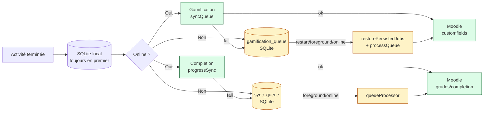

# IPELAN — Architecture de Synchronisation

> Dernière mise à jour : reflète l'état réel du code (schema v5, gamification_queue persistée).

---

## Vue d'ensemble — Deux systèmes de sync parallèles

```
┌─────────────────────────────────────────────────────────────────────┐
│                     IPELAN SYNC SYSTEM                              │
│                                                                     │
│  ┌──────────────────────────┐   ┌──────────────────────────────┐   │
│  │   SYSTÈME 1              │   │   SYSTÈME 2                  │   │
│  │   Gamification Queue     │   │   SQLite Queue (Moodle API)  │   │
│  │   syncQueue.ts           │   │   sync-queue.ts              │   │
│  │                          │   │                              │   │
│  │   XP · Coins · Streak    │   │   Complétions · Notes        │   │
│  │   Lives · Badges         │   │   core_grades_update_grades  │   │
│  │                          │   │   core_completion_*          │   │
│  │   In-memory + SQLite     │   │   SQLite permanent           │   │
│  │   (gamification_queue)   │   │   (sync_queue)               │   │
│  └──────────┬───────────────┘   └──────────────┬───────────────┘   │
│             │                                   │                   │
│             ▼                                   ▼                   │
│  ┌──────────────────────────────────────────────────────────────┐  │
│  │              MOODLE 4.4.3 — moodle.richatt.com               │  │
│  │     core_user_update_users (customfields)                     │  │
│  │     core_grades_update_grades                                 │  │
│  │     core_completion_update_activity_completion_status_manually│  │
│  └──────────────────────────────────────────────────────────────┘  │
└─────────────────────────────────────────────────────────────────────┘
```

---

## Système 1 — Gamification Queue (`syncQueue.ts`)

### Données synchronisées
- XP (`ipelan_xp`)
- Pièces (`ipelan_coins`)
- Streak (`ipelan_streak`)
- Vies (`ipelan_lives` + `ipelan_last_lives_update`)
- Badges (`ipelan_badges`, `ipelan_badges_count`, `ipelan_last_badge`)
- Date activité (`ipelan_last_activity`)

### Déclencheurs (quand la sync se fait)

| Événement | Fichier | Méthode |
|-----------|---------|---------|
| XP ajouté | `hooks/useUserStats.ts:292` | `syncQueue.syncGamification(userId, token)` |
| Coins ajoutés | `hooks/useUserStats.ts:308` | `syncQueue.syncGamification(userId, token)` |
| Streak mis à jour | `hooks/useUserStats.ts:308` | `syncQueue.syncGamification(userId, token)` |
| Badge gagné | `hooks/useUserStats.ts:324` | `syncQueue.syncGamification(userId, token)` |
| Vie achetée | `hooks/useLives.ts:66` | `syncQueue.syncGamification(userId, token)` |
| Fin activité (activity-progress) | `services/storage/activity-progress.ts:119` | `syncQueue.syncGamification(userId, token)` |
| Stats locales > Moodle au login | `hooks/useUserStats.ts:219` | `syncQueue.syncGamification(userId, token)` |
| Background OS (15 min) | `services/api/backgroundSync.ts:135` | `syncQueue.syncGamification(userId, token)` |
| Démarrage app (auth restaurée) | `app/_layout.tsx` | `syncQueue.restorePersistedJobs(token)` |

### Persistance SQLite (schema v5)

```
addJob('gamification', userId, token, {})
  ├─ Ajoute en mémoire
  └─ INSERT OR REPLACE INTO gamification_queue  ← survit aux crashes

processQueue() succès
  ├─ jobs.shift()
  └─ DELETE FROM gamification_queue

processQueue() échec définitif (5 tentatives)
  ├─ jobs.shift()
  └─ DELETE FROM gamification_queue

restorePersistedJobs(freshToken)  ← appelé au démarrage
  ├─ SELECT FROM gamification_queue
  └─ Reconstruit les jobs en mémoire (token NON stocké en SQLite)
```

> **Sécurité** : le token n'est jamais persisté dans `gamification_queue`. Il est rechargé depuis Redux au redémarrage.

### Retry

```
Tentative 1 : immédiate
Tentative 2 : 1s
Tentative 3 : 2s
Tentative 4 : 4s
Tentative 5 : 8s (max 30s)
→ Abandon après 5 échecs + suppression SQLite
```

### Dédup

Un seul job `gamification` par `(userId, type)` en mémoire et en SQLite.  
`INSERT OR REPLACE` remplace le précédent → toujours les données les plus récentes.

---

## Système 2 — SQLite Queue (`sync-queue.ts` + `queueProcessor.ts`)

### Données synchronisées
- Complétions manuelles (`core_completion_update_activity_completion_status_manually`)
- Notes Moodle (`core_grades_update_grades`)

### Flux après une activité

```
result.tsx → syncAfterActivity({courseId, cmid, score, maxScore, userId})
                │
                ▼
          progressSync.ts — syncActivityCompletion()
                │
                ├── Online ?
                │     ├── YES → resolveIds(courseId, cmid)
                │     │          ├── modname = quiz   → markManualCompletion() uniquement
                │     │          ├── modname = assign → core_grades_update_grades
                │     │          ├── modname = choice → markManualCompletion()
                │     │          ├── modname = glossary → markManualCompletion()
                │     │          └── modname inconnu  → markManualCompletion()
                │     │
                │     └── resolveIds échoue
                │                └── addToSyncQueue('completion', ...) ← retry auto
                │
                └── Offline → addToSyncQueue('completion', ...) ← retry auto
```

### Déclencheurs du queueProcessor

| Déclencheur | Implémentation |
|-------------|----------------|
| Démarrage app | `registerQueueProcessor()` → `processQueue()` immédiat |
| App revient foreground | `AppState.addEventListener('change', active)` |
| Réseau revient (offline→online) | `NetInfo.addEventListener` + `wasOffline` flag |

### Retry (queueProcessor)

```
MAX_RETRIES = 3
BACKOFF_BASE_MS = 2000

Tentative 1 : immédiate
Tentative 2 : 2s
Tentative 3 : 4s (2000 × 2^1)
→ Abandon après 3 échecs (item reste en SQLite mais ignoré)
```

---

## Schéma global — Offline-First



---

## Ce qui N'est PAS synchronisé automatiquement

| Donnée | Situation | Raison |
|--------|-----------|--------|
| Profil (nom, email) | Seulement sur action manuelle dans edit-profile | `moodleFetch core_user_update_users` |
| Progression cours % | Calculée côté app depuis `activity_progress` | Pas de push direct `course_progress` |
| Mot de passe | Jamais stocké localement | Sécurité |

---

## Indicateur visuel de sync

`hooks/useSyncStatus.ts` — s'abonne à `syncQueue.subscribe()` :

| Status | Affichage |
|--------|-----------|
| `synced` | Vert transparent |
| `syncing` | Bleu discret |
| `pending` | Orange très discret |
| `error` | Rouge très discret |

---

## Logs de debug (IS_DEV uniquement)

```
[SyncQueue] Job added: gamification {}
[SyncQueue] Job completed: gamification
[SyncQueue] 2 job(s) restauré(s) depuis SQLite
[QueueProcessor] ✅ Traité: core_completion_update_activity_completion_status_manually
[QueueProcessor] ❌ Échec retry 1: ...
[ProgressSync] Sync assign cmid=123 score=85/100
[ProgressSync] ✅ Note envoyée assign instance=456 score=85
[ProgressSync] Offline — completion queued cmid=123
```
